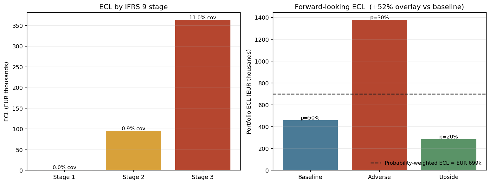

# IFRS 9 ECL Engine

[](https://github.com/ShrishDhuria/IFRS9_ECL/actions/workflows/tests.yml)

A practitioner-grade expected-credit-loss (ECL) engine for IFRS 9 impairment,
built end to end across five phases: from a single Stage 1 loan through PD term
structures, three-stage classification with a full SICR waterfall, macroeconomic
scenario overlays, and finally a forward-looking *point-in-time* PD derived from
a one-factor Vasicek/ASRF model. It is built around the IFRS 9 measurement
identity — discounted **PD × LGD × EAD** — and shows how each regulatory concept
(staging, SICR, forward-looking information, probability-weighted scenarios) maps
onto code that a credit-risk or impairment team would recognise.

Every phase ships in **parallel Python and Excel**, with a Streamlit dashboard
for interactive exploration and a methodology deck for the narrative. The PD
anchors are real (S&P Global), the macro paths are real (EBA 2025 EU-wide stress
test), and the regulatory citations are woven in at each site, not bolted on.

## What it demonstrates

The rigorous core is replacing the ad-hoc "notch-shift" macro overlay with a **single-factor Vasicek/ASRF point-in-time PD**, then computing **probability-weighted ECL** across baseline/adverse/upside scenarios (IFRS 9 §B5.5.42). On the sample book this reproduces the characteristic IFRS 9 dynamics: Stage 3 carries the overwhelming majority of ECL (≈11% coverage versus well under 1% in Stage 1), and the forward-looking scenario weighting lifts ECL roughly **52% above the baseline-only number** — exactly the cliff a single-scenario model understates.



*Left: ECL by IFRS 9 stage, with coverage ratios. Right: portfolio ECL under each macro scenario and the probability-weighted aggregate (the +52% forward-looking overlay vs baseline). Computed by the deterministic engine — `python make_figures.py`.*

## Status

| Phase | Scope | Module | Status |
|---|---|---|---|
| 1 | 12-month ECL for a single Stage 1 exposure; S&P 1Y PD anchors | `ecl_engine_phase1.py` | Complete |
| 2 | PD term structures from cumulative defaults; bullet & annuity amortisation; lifetime ECL (Stage 2/3) | `ecl_engine_phase2.py` | Complete |
| 3 | Three-stage classification, SICR waterfall, 30/90-DPD backstops, portfolio aggregation | `ecl_engine_phase3.py` | Complete |
| 4 | Macro scenarios (baseline/upside/adverse), transition-based PD stress, probability-weighted ECL, sensitivity | `ecl_engine_phase4.py` | Complete |
| 5 | Forward-looking PIT PD via single-factor Vasicek/ASRF (the rigorous replacement for the Phase 4 notch-shift) | `macro_pd.py` | Complete |
| — | Two-tab interactive dashboard (single-loan + portfolio) | `app.py` | Complete |
| — | Parallel Excel implementation, one workbook per phase | `IFRS9_ECL_Phase1–4.xlsx` | Complete |
| — | Methodology deck | `IFRS9_ECL_Methodology.pptx` | Complete |

## The measurement chain

```
   rating + exposure + LGD/EAD                         (Phase 1)
            │
            ▼
   PD term structure  (marginal PDs from S&P cumulative)   (Phase 2)
            │            + amortisation → EAD profile
            ▼
   lifetime ECL = Σ_t  discount_t · marginal_PD_t · LGD · EAD_t
            │
            ▼
   staging:  Stage 1 (12m)  →  Stage 2 (lifetime, SICR)  →  Stage 3 (impaired)   (Phase 3)
            │   SICR = relative PD change ∪ absolute PD change ∪ qualitative ∪ 30-DPD
            ▼
   forward-looking overlay:  baseline / upside / adverse                          (Phase 4)
            │   PD stressed by rating migration (notch shift), LGD by downturn uplift
            ▼
   probability-weighted ECL  =  Σ_s  w_s · ECL_s     (IFRS 9 B5.5.42–44)
            │
            ▼
   PIT PD, derived not asserted:  PD(z) = Φ( Φ⁻¹(PD_ttc) − √(ρ/(1−ρ))·z )         (macro_pd)
                where z is the systematic macro factor implied by GDP/unemployment paths
```

The two-line story for the macro layer: **Phase 4** stresses PD by *asserting* a
rating migration of N notches per scenario — the standard, transparent teaching
form. **`macro_pd.py`** then *derives* that same stress from first principles: it
maps the scenario's GDP and unemployment deviations to a systematic factor `z`,
runs `z` through the one-factor Vasicek model that underpins the Basel IRB
framework, and reads off both the conditional PIT PD and the *implied* notch
shift. The asserted shift becomes a special case of the derived one (and `z = 0`
returns the through-the-cycle PD exactly, so baseline leaves PD unchanged).

## Architecture

```
ifrs9-ecl-engine/
├── ecl_engine_phase1.py        # 12m ECL, Stage 1; S&P Table 26 1Y PDs (global + Europe)
├── ecl_engine_phase2.py        # PD term structure (marginal from cumulative), amortisation, lifetime ECL
├── ecl_engine_phase3.py        # Stage 1/2/3 classification + SICR engine + DPD backstops + portfolio ECL
├── ecl_engine_phase4.py        # Macro scenarios, transition-based PD stress, downturn LGD, weighted ECL
├── macro_pd.py                 # Single-factor Vasicek/ASRF PIT-PD; macro→z bridge; implied notch shift
├── app.py                      # Streamlit dashboard (Tab 1: single-loan; Tab 2: portfolio)
├── IFRS9_ECL_Phase1.xlsx       # Parallel Excel — single-loan 12m ECL
├── IFRS9_ECL_Phase2.xlsx       # Parallel Excel — PD term structure + lifetime ECL
├── IFRS9_ECL_Phase3.xlsx       # Parallel Excel — staging + portfolio aggregation
├── IFRS9_ECL_Phase4.xlsx       # Parallel Excel — scenarios + probability-weighted ECL
├── IFRS9_ECL_Methodology.pptx  # Methodology deck
├── tests/                      # pytest suite
│   ├── conftest.py
│   ├── test_phase1_2.py        # 12m + lifetime ECL, term-structure construction
│   ├── test_phase3_4.py        # staging, SICR triggers, scenario weighting
│   └── test_macro_pd.py        # Vasicek monotonicity, z=0 ⇒ TTC, calibration
├── requirements.txt            # streamlit, matplotlib, numpy
├── requirements-dev.txt        # pytest
└── sources.md                  # Data provenance + methodology references
```

A deliberate engineering choice: the only runtime dependencies are `numpy`,
`matplotlib`, and `streamlit`. The normal CDF/inverse-CDF used by the Vasicek
model are implemented in closed form in `macro_pd.py` (Abramowitz–Stegun / Acklam),
so there is **no SciPy dependency** — the engine is self-contained and the
statistics are visible rather than hidden behind a library call.

## The SICR waterfall (Phase 3)

A loan moves from Stage 1 (12-month ECL) to Stage 2 (lifetime ECL) on a
*significant increase in credit risk* since origination. The engine tests four
triggers in sequence and stages on the first that fires:

1. **Quantitative — relative** — the lifetime PD has risen by more than a
   configurable multiple of its origination value (IFRS 9 B5.5.17–18).
2. **Quantitative — absolute** — an absolute PD increase threshold, to catch
   high-quality names where a large relative jump is still a small absolute one.
3. **Qualitative** — watchlist / forbearance / covenant flags.
4. **30-DPD backstop** — the rebuttable presumption of IFRS 9 §5.5.11.

Stage 3 (credit-impaired) is triggered by the **90-DPD** default definition of
**CRR Art. 178** or an explicit default flag. Migration distance is measured in
notches on the full S&P scale, so the staging logic is rating-aware rather than
PD-only.

## Quick start

```bash
python -m venv .venv && source .venv/bin/activate
pip install -r requirements.txt

# Each phase runs standalone and prints a worked example:
python ecl_engine_phase1.py     # 12-month ECL, single Stage 1 loan
python ecl_engine_phase2.py     # PD term structure + lifetime ECL
python ecl_engine_phase3.py     # staging + SICR + portfolio ECL
python ecl_engine_phase4.py     # scenarios + probability-weighted ECL
python macro_pd.py              # Vasicek PIT-PD + scenario calibration

# Interactive dashboard:
streamlit run app.py
```

## Limitations

The modelling choices a validator would want flagged:

- **PD calibration uses agency through-the-cycle averages.** S&P 1-year PDs are mapped to a point-in-time view via the Vasicek model; the asset correlation ρ and the macro-to-systemic-factor mapping are calibrated to EBA scenario severity, not estimated from the bank's own default history.
- **LGD is exogenous and largely static.** Downturn LGD is applied only where set; collateral dynamics and cure rates are not modelled.
- **Three discrete scenarios approximate the macro distribution.** Fixed probabilities on baseline/adverse/upside stand in for the full distribution; tail states beyond "adverse" are not represented.
- **SICR thresholds are policy choices.** The notch-downgrade and 30/90-DPD backstops are judgemental — the standard deliberately leaves them to the institution.
- **No behavioural modelling.** Amortisation is bullet/annuity only; prepayment and revolving-exposure behaviour are out of scope.

Run the test suite with:

```bash
pip install -r requirements-dev.txt
pytest -q
```

The 41-test suite also runs automatically on every push via GitHub Actions
(`.github/workflows/tests.yml`).

The Excel workbooks (`IFRS9_ECL_Phase1–4.xlsx`) mirror each Python phase
cell-for-cell, so the same numbers can be traced in a spreadsheet — useful for
walking a non-technical reviewer through the calculation.

## Headline figures used (real anchors)

| Input | Source | Example value |
|---|---|---|
| 1Y PD, BBB / BB / B / CCC (global) | S&P 2024 Default Study, Table 26 | 0.13% / 0.44% / 2.69% / 26.12% |
| 1Y PD, BBB / BB / B / CCC (Europe) | S&P 2024 Default Study, Table 25 | 0.05% / 0.36% / 1.75% / 26.26% |
| LGD (senior unsecured / subordinated) | CRR Art. 161 (F-IRB) | 45% / 75% |
| Adverse macro path (EU, 2025–27) | EBA 2025 EU-wide stress test | GDP −6.3%, unemployment +6.1pp, equities −50% |

## Known simplifications

Deliberate scope choices, documented inline, not oversights:

- **PDs are through-the-cycle anchors** (S&P long-run averages). The point-in-time
  adjustment lives in the macro layer; Phases 1–3 use the TTC values directly,
  which is the standard academic/interview baseline.
- **LGD is a regulatory anchor with a downturn uplift**, not an empirically
  calibrated curve. `sources.md` lists the EBA IRB benchmarking and Banque de
  France recovery studies that would replace it in a production calibration.
- **Scenario probability weights are expert-set** (illustrative), with a
  sensitivity panel showing how the weighted ECL moves as the adverse weight is
  varied — rather than estimated from a transition model.
- **The macro→z bridge in `macro_pd.py` uses linear sensitivities** to GDP and
  unemployment deviations; the asset correlation `ρ` follows the Basel corporate
  formula. Both are visible parameters, not fitted.

## Regulatory references

- **IFRS 9** — Financial Instruments (IASB). Key paragraphs: §5.5.3–5.5.5
  (staging & measurement), §5.5.9 / §5.5.11 (SICR & 30-DPD presumption),
  §5.5.17(c) (forward-looking information), §B5.5.17–18 (relative vs absolute PD
  change), §B5.5.42–44 (probability-weighted ECL), Appendix A (credit-impaired).
- **CRR (Regulation (EU) No 575/2013)** — Art. 161 (F-IRB LGD), Art. 178
  (definition of default / 90-DPD backstop).
- **EBA GL/2017/06** — Guidelines on ECL accounting practices for credit
  institutions (scenario design and weighting, §30–32).
- **EBA 2025 EU-wide stress test** — macro-financial scenario (Jan 2025) and
  methodological note (staging under stress, §73–75).
- **ACPR** — French supervisory expectations on IFRS 9 implementation.

See [`sources.md`](sources.md) for the full provenance of every PD, LGD, and macro
input, including document titles, dates, tables, and URLs.
